# 🏗️ TrekPal System Architecture

<div align="center">

**Comprehensive architectural documentation for the TrekPal travel ecosystem**

[Overview](#-system-overview) • [Components](#-system-components) • [Data Flow](#-data-flow) • [Database](#-database-schema)

</div>

---

## 📋 Table of Contents

- [System Overview](#-system-overview)
- [High-Level Architecture](#-high-level-architecture)
- [System Components](#-system-components)
- [Technology Stack](#-technology-stack)
- [Data Flow](#-data-flow)
- [Database Schema](#-database-schema)
- [API Architecture](#-api-architecture)
- [Authentication Flow](#-authentication-flow)
- [Real-Time Communication](#-real-time-communication)
- [Deployment Architecture](#-deployment-architecture)

---

## 🎯 System Overview

TrekPal is a **modular, full-stack travel management ecosystem** built with modern technologies. The system follows a **microservices-inspired architecture** with clear separation of concerns between client applications, backend services, and data layers.

### Design Principles

- ✅ **Modularity** - Independent, reusable components
- ✅ **Scalability** - Horizontal scaling capabilities
- ✅ **Type Safety** - TypeScript throughout the stack
- ✅ **Real-time** - WebSocket support for live updates
- ✅ **Security** - JWT authentication and role-based access
- ✅ **Maintainability** - Clean code and clear documentation

---

## 🏛️ High-Level Architecture

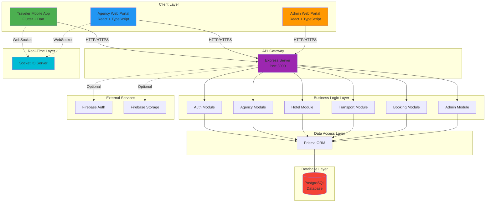

---

## 🧩 System Components

### 1. Client Applications

#### Traveler Mobile App (Flutter)
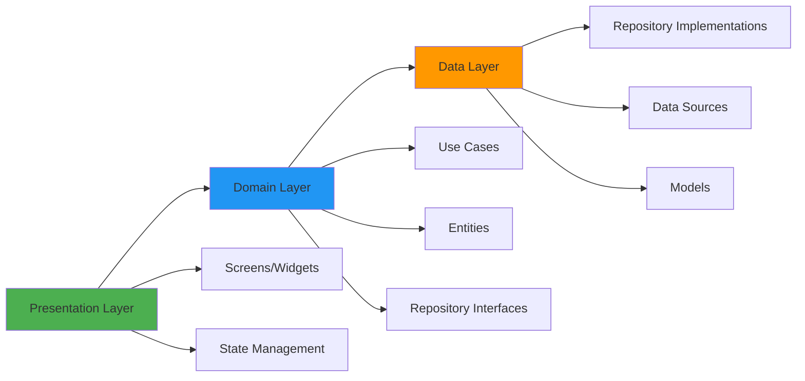

**Features:**
- Clean Architecture + MVVM pattern
- State management with Riverpod/Bloc
- Offline-first capabilities
- Firebase integration
- Real-time chat

#### Agency Portal (React)
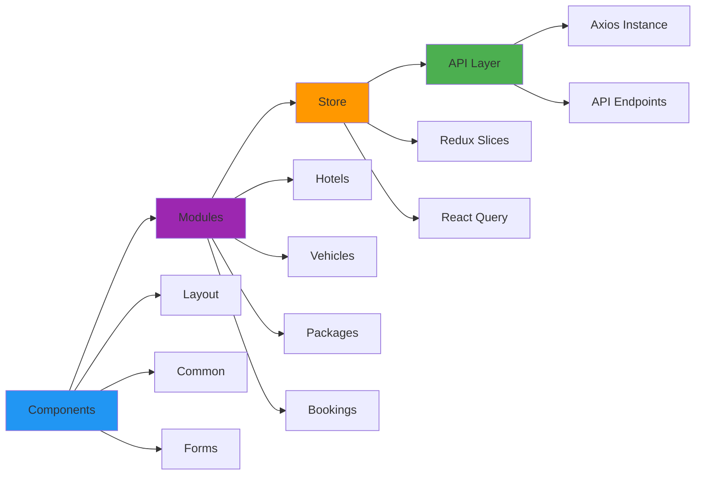

**Features:**
- Redux Toolkit for state management
- React Query for server state
- Tailwind CSS for styling
- Protected routes
- Real-time notifications

#### Admin Portal (React)
Similar architecture to Agency Portal with admin-specific features:
- Platform oversight
- Approval workflows
- Analytics dashboard
- User management

### 2. Backend Services

#### Express API Server

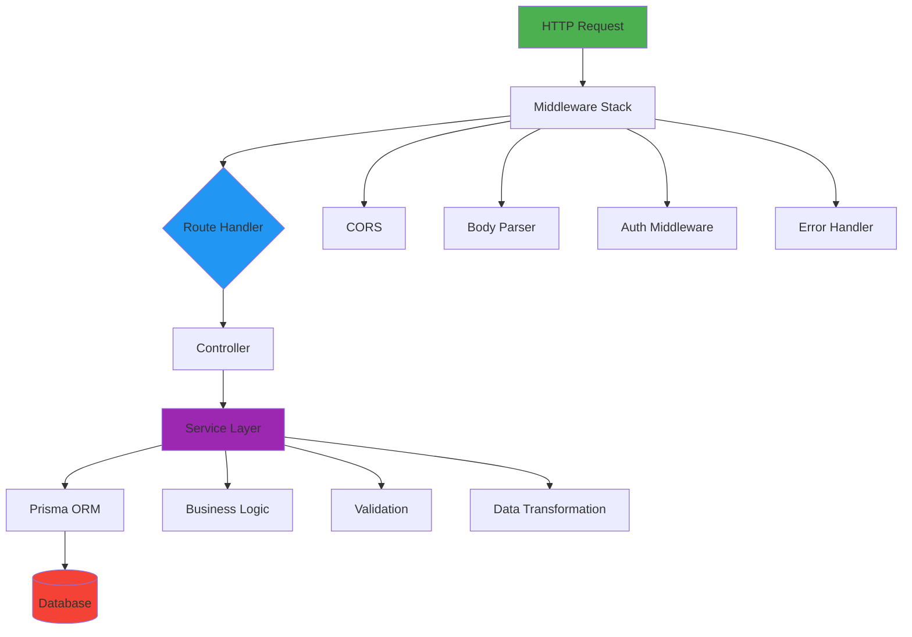

**Module Structure:**
```
backend/src/
├── config/              # Configuration files
│   ├── env.ts          # Environment variables
│   └── firebase.ts     # Firebase setup
├── middlewares/         # Express middlewares
│   ├── auth.middleware.ts
│   └── error.middleware.ts
├── modules/             # Feature modules
│   ├── auth/
│   │   ├── auth.controller.ts
│   │   ├── auth.service.ts
│   │   ├── auth.routes.ts
│   │   └── auth.types.ts
│   ├── agency/
│   ├── hotels/
│   ├── transport/
│   ├── bookings/
│   └── admin/
├── utils/               # Utility functions
├── ws/                  # WebSocket handlers
└── server.ts            # Application entry point
```

---

## 💻 Technology Stack

### Frontend Technologies

| Layer | Technology | Purpose |
|-------|------------|---------|
| **Mobile** | Flutter 3.0+ | Cross-platform mobile framework |
| **Web** | React 18.2 | UI library |
| **Language** | TypeScript 5.3 | Type-safe JavaScript |
| **Build Tool** | Vite 5.0 | Fast build and HMR |
| **State** | Redux Toolkit | Global state management |
| **Server State** | React Query | API data caching |
| **Styling** | Tailwind CSS | Utility-first CSS |
| **HTTP** | Axios | HTTP client |

### Backend Technologies

| Layer | Technology | Purpose |
|-------|------------|---------|
| **Runtime** | Node.js 18+ | JavaScript runtime |
| **Framework** | Express 4.18 | Web framework |
| **Language** | TypeScript 5.3 | Type safety |
| **ORM** | Prisma 5.7 | Database toolkit |
| **Database** | PostgreSQL 14+ | Relational database |
| **WebSocket** | Socket.IO 4.6 | Real-time communication |
| **Auth** | JWT + Firebase | Authentication |
| **Validation** | Zod 3.22 | Schema validation |

---

## 🔄 Data Flow

### Request-Response Flow

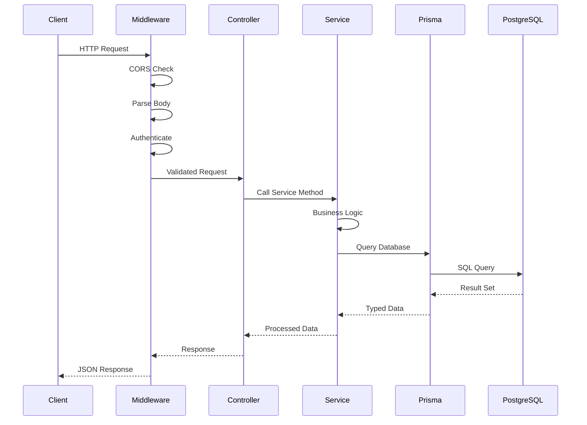

### Booking Flow Example

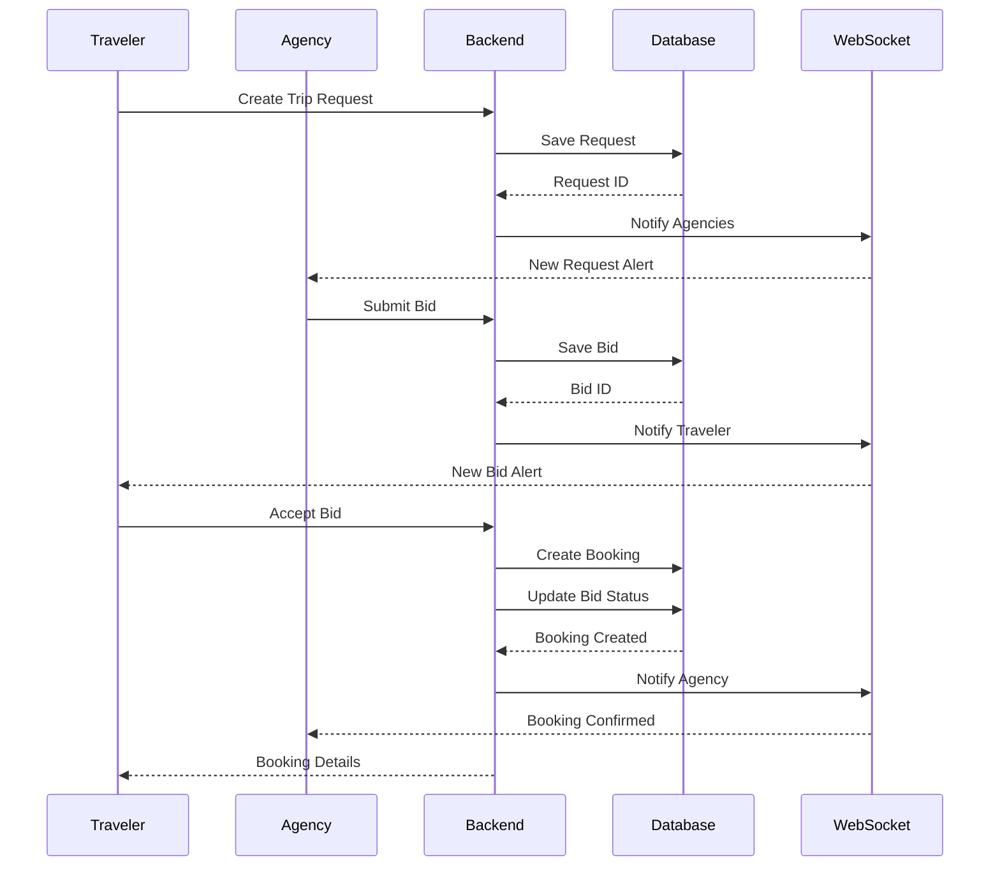

---

## 🗄️ Database Schema

### Entity Relationship Diagram

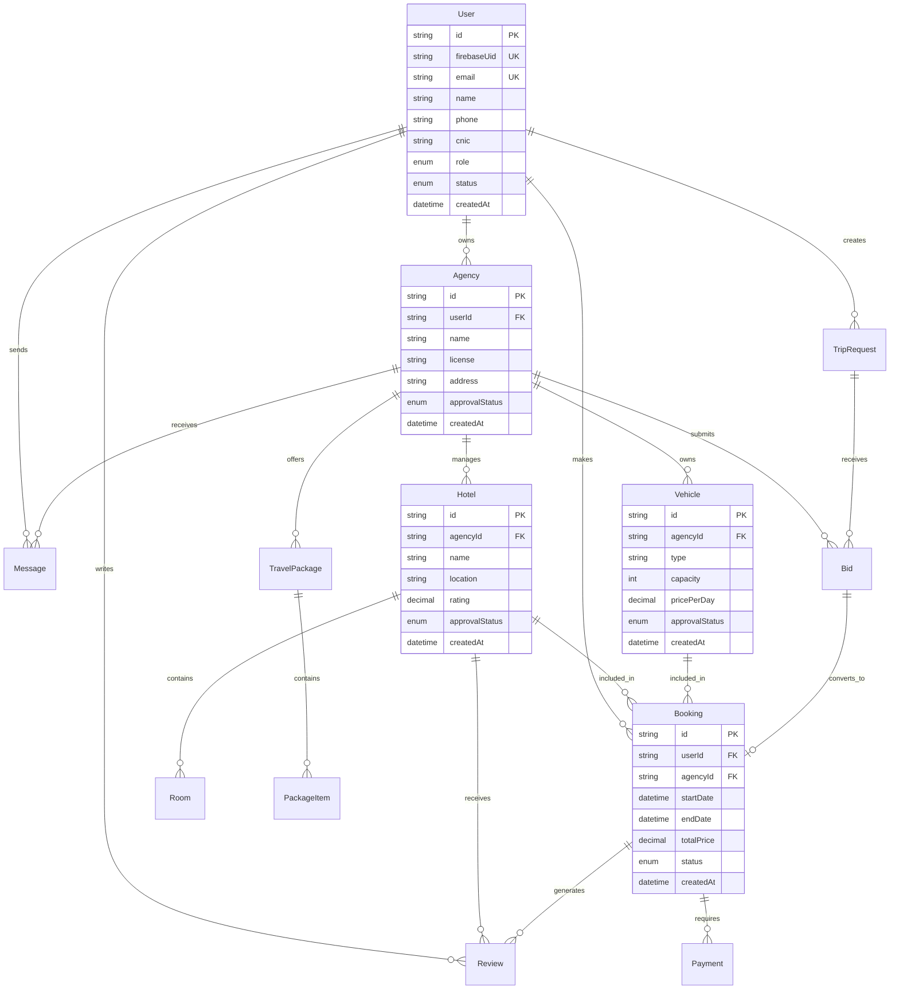

### Key Tables

#### Users
- Stores all user accounts (travelers, agency owners, admins)
- Linked to Firebase authentication
- Role-based access control

#### Agencies
- Travel agency information
- Approval workflow (PENDING → APPROVED/REJECTED)
- Linked to owner user account

#### Hotels
- Hotel listings managed by agencies
- Room inventory
- Approval workflow

#### Vehicles
- Vehicle fleet managed by agencies
- Pricing and availability
- Approval workflow

#### Bookings
- Central booking entity
- Links users, agencies, hotels, vehicles
- Payment tracking
- Status management

---

## 🔌 API Architecture

### RESTful API Design

```
/api
├── /auth
│   ├── POST /register/user
│   ├── POST /register/agency
│   ├── POST /login
│   └── GET /profile
├── /agencies
│   ├── GET /
│   ├── GET /:id
│   └── PUT /:id
├── /hotels
│   ├── GET /
│   ├── POST /
│   ├── GET /:id
│   └── PUT /:id
├── /transport
│   ├── GET /
│   ├── POST /
│   ├── PUT /:id
│   └── DELETE /:id
├── /bookings
│   ├── GET /
│   ├── POST /
│   └── GET /:id
└── /admin
    ├── GET /agencies
    ├── POST /agencies/:id/approve
    ├── GET /hotels
    ├── POST /hotels/:id/approve
    └── GET /reports/dashboard
```

### API Response Format

**Success Response:**
```json
{
  "success": true,
  "message": "Operation successful",
  "data": { /* response data */ }
}
```

**Error Response:**
```json
{
  "success": false,
  "message": "Error description",
  "errors": { /* validation errors */ }
}
```

---

## 🔐 Authentication Flow

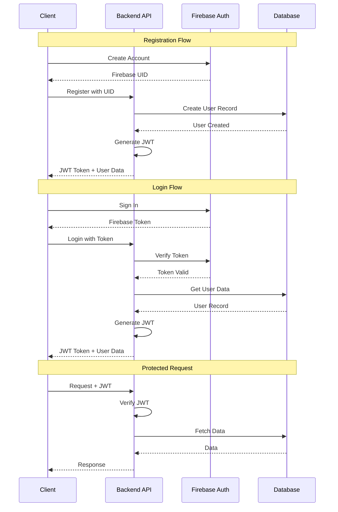

### JWT Token Structure

```json
{
  "header": {
    "alg": "HS256",
    "typ": "JWT"
  },
  "payload": {
    "uid": "firebase-uid",
    "email": "user@example.com",
    "role": "TRAVELER",
    "iat": 1234567890,
    "exp": 1234654290
  }
}
```

---

## 💬 Real-Time Communication

### WebSocket Architecture

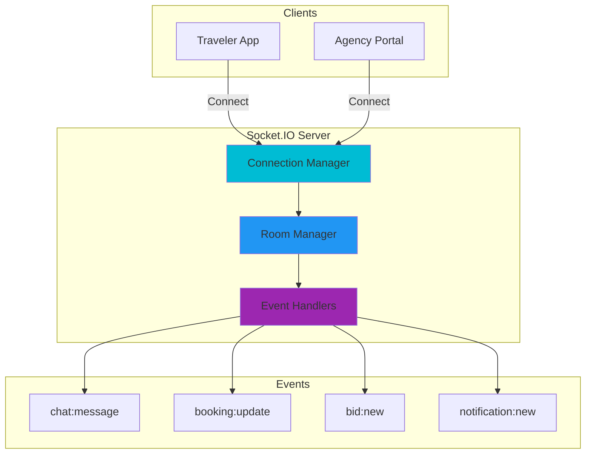

### Socket Events

| Event | Direction | Purpose |
|-------|-----------|---------|
| `chat:message` | Bidirectional | Real-time messaging |
| `booking:update` | Server → Client | Booking status changes |
| `bid:new` | Server → Client | New bid notifications |
| `notification:new` | Server → Client | General notifications |
| `user:online` | Server → Client | User presence |

---

## 🚀 Deployment Architecture

### Production Deployment

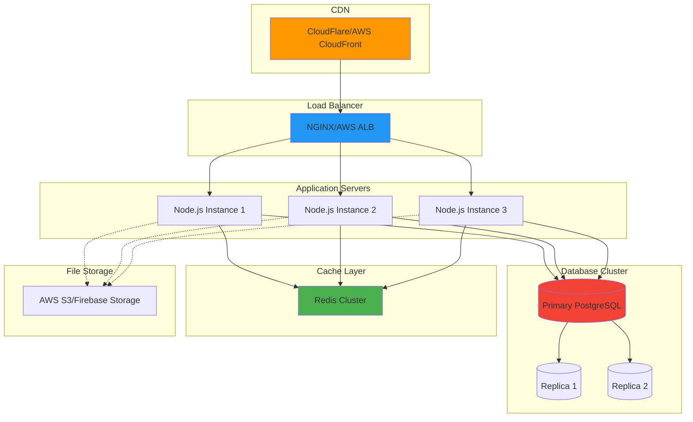

### Scaling Strategy

#### Horizontal Scaling
- Multiple Node.js instances behind load balancer
- Stateless application design
- Session management with Redis

#### Database Scaling
- Primary-replica replication
- Read replicas for query distribution
- Connection pooling with Prisma

#### Caching Strategy
- Redis for session storage
- API response caching
- Database query result caching

---

## 📊 Performance Considerations

### Optimization Techniques

| Area | Technique | Benefit |
|------|-----------|---------|
| **Database** | Indexing | Faster queries |
| **Database** | Connection pooling | Reduced overhead |
| **API** | Response caching | Reduced load |
| **API** | Pagination | Smaller payloads |
| **Frontend** | Code splitting | Faster initial load |
| **Frontend** | Lazy loading | On-demand resources |
| **Images** | CDN delivery | Faster asset loading |
| **Images** | Compression | Reduced bandwidth |

---

## 🔒 Security Architecture

### Security Layers

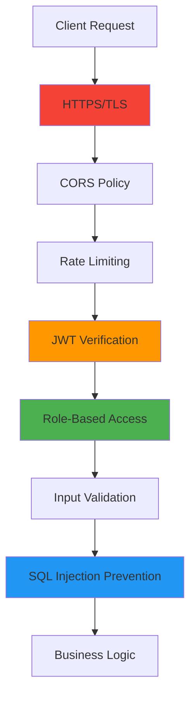

### Security Measures

- ✅ HTTPS/TLS encryption
- ✅ JWT token authentication
- ✅ Role-based access control (RBAC)
- ✅ Input validation with Zod
- ✅ SQL injection prevention (Prisma)
- ✅ XSS protection
- ✅ CSRF protection
- ✅ Rate limiting
- ✅ Secure password hashing

---

<div align="center">

**[⬆ Back to Top](#️-trekpal-system-architecture)**

For more information, see the [main README](README.md)

</div>
