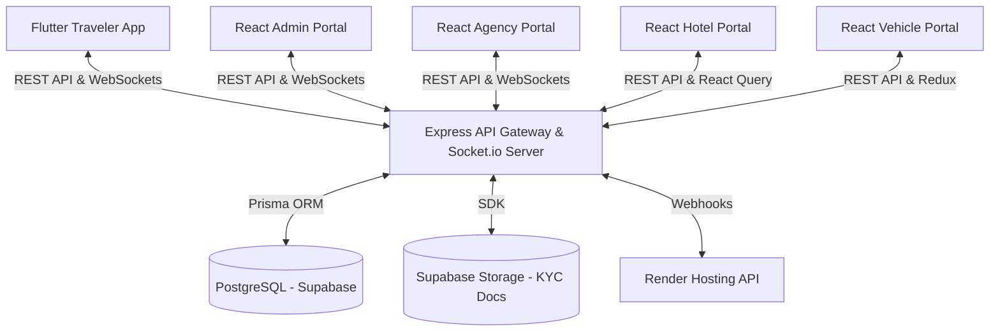

# 🌍 TrekPal Ecosystem Monorepo

Welcome to the **TrekPal Travel Management Ecosystem**. TrekPal is an all-in-one travel logistics, bidding, and booking platform that integrates travelers, travel agencies, hotel managers, vehicle providers, and platform administrators into a unified, real-time ecosystem.

---

## 🏗️ Ecosystem Architecture

The TrekPal platform consists of **six core components** managed in an npm workspaces monorepo:


```mermaid
graph TD
    %% Portals and Apps
    TravelerApp[Flutter Traveler App]
    AdminPortal[React Admin Portal]
    AgencyPortal[React Agency Portal]
    HotelPortal[React Hotel Portal]
    VehiclePortal[React Vehicle Portal]
    
    %% API Gateway / Backend
    Backend[Express API Gateway & Socket.io Server]
    
    %% DB & Cloud Providers
    Postgres[(PostgreSQL - Supabase)]
    Storage[(Supabase Storage - KYC Docs)]
    Render[Render Hosting API]

    %% Communications
    TravelerApp <-->|REST API & WebSockets| Backend
    AdminPortal <-->|REST API & WebSockets| Backend
    AgencyPortal <-->|REST API & WebSockets| Backend
    HotelPortal <-->|REST API & React Query| Backend
    VehiclePortal <-->|REST API & Redux| Backend
    
    Backend <-->|Prisma ORM| Postgres
    Backend <-->|SDK| Storage
    Backend <-->|Webhooks| Render
```

---

## 📂 Project Modules & Documentation

Click on any specific portal or application below to read details on **how it works**, its **technologies**, and **setup instructions**:

* ⚙️ **[Backend API](docs/backend.md)**: Express.js + Prisma ORM + Socket.io Server
* 🛡️ **[Admin Portal](docs/admin-portal.md)**: React Web App for platform oversight
* 🏢 **[Agency Portal](docs/agency-portal.md)**: React Web App for travel agencies
* 🏨 **[Hotel Portal](docs/hotel-portal.md)**: React Web App for hotel managers
* 🚗 **[Vehicle Portal](docs/vehicle-portal.md)**: React Web App for vehicle providers
* 📱 **[Traveler Mobile App](docs/traveler-app.md)**: Flutter Mobile Application for tourists

---

## 🚀 Getting Started

### 📥 1. Installation
Clone the repository and install all workspaces dependencies from the root directory:
```bash
git clone https://github.com/your-repo/trekpal.git
cd trekpal
npm install
```
*This command runs workspaces sync and installs dependencies for the backend and all four web portals.*

### 🔑 2. Environment Configuration
Create a `.env` file inside the `backend` folder:
```env
# backend/.env
NODE_ENV=development
PORT=3000
JWT_SECRET=your-super-secret-jwt-key

# Database & Supabase Configuration
DATABASE_URL="postgresql://[USER]:[PASSWORD]@[POOLER_HOST]:5432/postgres?sslmode=require"
DIRECT_URL="postgresql://[USER]:[PASSWORD]@[DIRECT_HOST]:5432/postgres?sslmode=require"
SUPABASE_URL="https://[YOUR_PROJECT_ID].supabase.co"
SUPABASE_SERVICE_ROLE_KEY="your-service-role-key"
```

Each web portal contains preconfigured `.env.development` (Local mode) and `.env.render` (Render mode) files.

---

## 🏃‍♂️ Running the Ecosystem

### 💻 Running the Web Apps (Monorepo)

| Scope | Script (Local Backend) | Script (Render Backend) | Description |
| :--- | :--- | :--- | :--- |
| **All Web Portals** | `npm run dev` | N/A | Boots Admin, Agency, Hotel, and Vehicle portals |
| **Full Stack (Web + API)** | `npm run dev:all` | N/A | Boots all 4 portals + Backend server |
| **Hotel Portal Only** | `npm run dev:hotel-only` | `npm run dev:hotel-only -- --mode render` | Boots Hotel Portal only |
| **Vehicle Portal Only** | `npm run dev:vehicle-only` | `npm run dev:vehicle-only -- --mode render` | Boots Vehicle Portal only |
| **Agency Portal Only** | `npm run dev:agency-only` | `npm run dev:agency-only -- --mode render` | Boots Agency Portal only |
| **Admin Portal Only** | `npm run dev:admin-only` | `npm run dev:admin-only -- --mode render` | Boots Admin Portal only |
| **Backend Only** | `npm run dev:backend-only` | N/A | Boots Backend server only |

---

## ☁️ Setting Up Your Own Supabase Instance
If you want to run this project with your own Supabase database instead of the default one, follow these steps:

### 1. Create a Supabase Project
1. Log in to the [Supabase Console](https://supabase.com/) and create a new project.
2. Choose your preferred region and set a strong database password.

### 2. Configure Database Connections
Prisma requires two connection URLs in your `backend/.env` file:
* **`DATABASE_URL` (Transaction Connection String)**:
  1. In your Supabase dashboard, navigate to **Project Settings** -> **Database**.
  2. Under **Connection string**, select the **URI** tab and choose **Transaction** mode.
  3. Copy the URL and replace the password placeholder with your actual database password.
* **`DIRECT_URL` (Direct Connection String)**:
  1. Under the same settings section, select **Session** mode (or choose the direct port `5432` connection string).
  2. This is used by Prisma to run schema migrations safely.

### 3. Initialize Tables & Seed Data
Once your `.env` connection strings are configured, run the following command from the workspace root:
```bash
npm run db:setup
```
**What this does automatically:**
1. Generates the Prisma Client locally.
2. Pushes the TrekPal database schema, automatically creating **all tables, indexes, constraints, and relations** inside your new Supabase project.
3. Seeds your database with essential default records (pre-configured admin accounts, hotels, agencies, vehicles, and bookings) so you can log in and test immediately.

---

## 🗄️ Database Setup & Migrations
TrekPal uses Prisma ORM to interact with the database. You can manage setup using the following workspace commands:

* **Complete First-Time Setup**: Pushes migrations and seeds initial records:
  ```bash
  npm run db:setup
  ```
* **Database Reset**: Resets migration history and re-seeds:
  ```bash
  npm run db:reset
  ```
* **Launch Prisma Studio**: Opens visual database explorer:
  ```bash
  npm run db:studio
  ```

---

## 🗺️ System Visualization & Graphs
For in-depth analysis and dependency maps:
1. Open `graphify-out/dashboard.html` in any web browser.
2. Explore the interactive **Global Ecosystem Graph** mapping routes, real-time websockets events, and Prisma schema links across the codebases.
