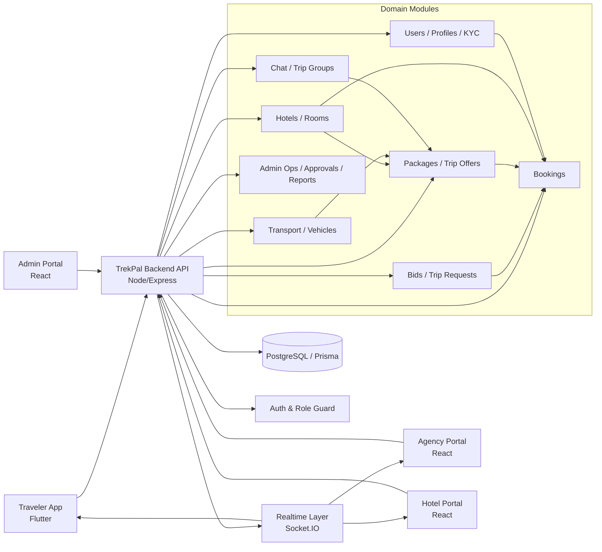

# TrekPal High-Level Graph (Cross-App)

## Graphify-Derived Hotspots

- Traveler app strongest hubs: `flutter/material.dart`, `provider`, shared formatters/loading widgets.
- Admin portal hotspot: `extractErrorMessage()` around approval/edit workflows.
- Agency portal hotspots: `ChatService`, `validateForm()`, image/room utility flows.
- Hotel portal is small and sparse; primary interactions are auth, rooms, bookings, settings/services.

## Notes

- This is a high-level architectural abstraction built from the generated graphify reports for:
  - `traveler-app/trekpal/lib`
  - `admin-portal/src`
  - `agency-portal/src`
  - `hotel-portal/src`
- For deeper dependency truth, run semantic-rich graphify on docs + code together (`--mode deep`) per app.
